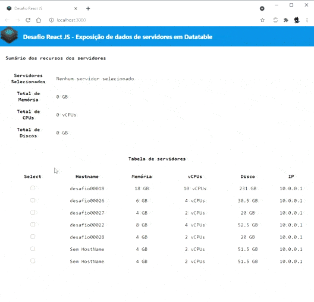

# Desafio React JS

## Descrição do desafio

Este é o desafio para seleção para desenvolvedores Front-End React JS. Nele você será convidado a construir uma página de exibição de dados de servidores conforme o modelo apresentado no Figma. Não é necessário construir a página com fidelidade total de estilização, pois, o mais importante para nós é conhecer a sua habilidade e domínio da biblioteca React, contudo, se você conseguir ser fiel ao modelo do Figma isso será considerado um plus.

## Como instalar e rodar na própria máquina

- `git clone https://github.com/EduardoReisUX/desafio-react`
- `cd desafio-react`
- `yarn install` para instalar dependências do package.json
- `yarn server` para simular um servidor
- `yarn start` com outro terminal aberto para executar o projeto

## Breve demonstração

